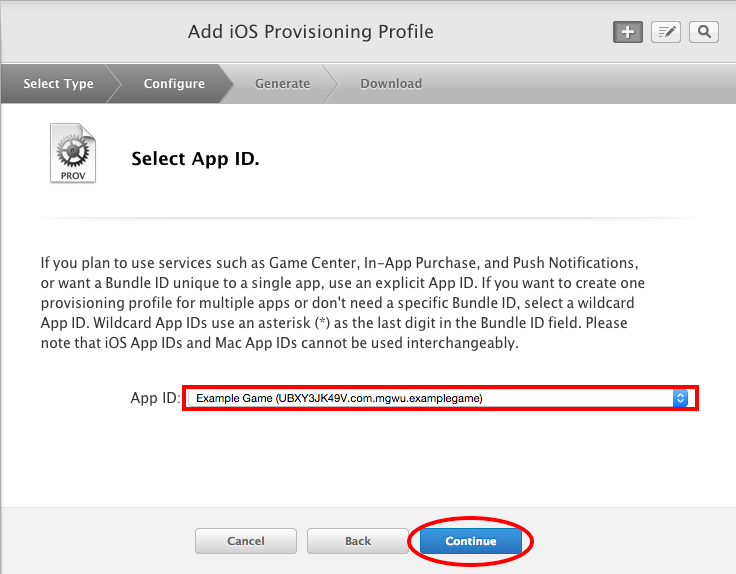

Once you have finished developing your app/game, you will face the most exciting step -- publishing it on the Apple App Store and making it available for the whole world to play!

Throughout the next pages we will guide you through the process of submitting your app. Submitting to the App Store takes a few steps:

1. Create an Apple Developer account
1. Check your project
1. Create an App ID
1. Create a record for your app in iTunes Connect
1. Archive and Upload your app to iTunes Connect
1. Submit to App Review
1. Wait for review
1. ???
1. Launch and start gathering users

# Create an Apple Developer Account

> [info]
>
**If you are under 18, you will need to publish under your an account connected to your parent/guardian's name. Since you will need regular access to this account, it may be best to ask them to create a new account specifically for publishing.** When you turn 18, you can register as developer under your own account and transfer the apps to it so they will be published under your name.
>
If you are using a new account to publish, make sure to add it to Xcode (`Xcode > Preferences > Accounts > +`) and update your project's "Team" (select your project from navigation panel in Xcode, update `Team` under `Signing` to be your new account).

First, you will need to create an Apple Developer Account to publish your app. Apple charges $99 a year for this account and you must have one to release apps on the app store. You can register as a developer on [Apple's Developer Portal](https://developer.apple.com/register/). If you already have an Apple ID you can sign in with that and purchase the Developer Account. If you don't have an Apple ID yet, you will have to create that first (there's a link on the page that brings you to the signup page).

Once you are successfully enrolled in Apple's developer program, you can move on to the next step!

# Check your project

Make sure your project is ready to launch. It should be fully functioning and bug free. **Spend some time reading through your code and make sure to remove any unneeded print statements.**

## Icon

Your app needs an icon if you don't already have one. Review the [branding lecture slides](https://www.dropbox.com/s/ycvb5zpallt38cf/Design.key?dl=0) if you need a refresher.

Focus on creating a bold, but simple icon that is at least 1024px x 1024px. Remember, pretty is better than a noticeable eye sore. If your icon looks spammy, users will assume your app does not work well.

Use a square! Not a rounded square. Apple will crop it for you!

Use a service or app to generate all the sizes you need and add them to your app:
- https://resizeappicon.com/
- https://makeappicon.com/

## Launch Screen

You app should also have a launch screen. Launch screens are shown when your app boots up. They should be simple and utilize your branding colors. See [this page](https://developer.apple.com/library/content/documentation/IDEs/Conceptual/AppDistributionGuide/ConfiguringYourApp/ConfiguringYourApp.html#//apple_ref/doc/uid/TP40012582-CH28-SW4) for more info.

## Version Number and Build String

Verify that your version number and build string are correct. Version number `1.0.0` and build string `1.0.0` is fine. See [this page](https://developer.apple.com/library/content/documentation/IDEs/Conceptual/AppDistributionGuide/ConfiguringYourApp/ConfiguringYourApp.html#//apple_ref/doc/uid/TP40012582-CH28-SW18) for how to check/set it.

> [info]
>
We suggest using the same value for version number and build string but historically, build string is used a bit differently. Read more about it [here](https://stackoverflow.com/questions/6851660/version-vs-build-in-xcode).
>
In general, a version number is 3 values separated by a `.`. The format can be represented as `[Major Version].[Minor Version].[Revision Number]`. I recommend you increment the revision number by one for bug fixes, minor version by one when you add new features, and major version by one when you add substantially new features or rewrite your app. Most apps will increment their major version less than once a year!

# Create an App ID and provisioning profile

## Find the Bundle Identifier of your App

To submit your App to the App Store, you will need your app's bundle identifier. The bundle identifier is a unique string for your app. You can find the current bundle identifier of your App in Xcode by selecting:

Typically bundle identifiers contain the domain name of your personal or company website and the name of your app (that ensures that the bundle id is unique), e.g. `com.makeschool.makestagram`. If you don't have a registered domain you can also use your full name, e.g. `com.dionlarson.myfirstapp`. If your bundle identifier is already taken, Apple's Web Portal will let you know in the next step.

> [info]
>
If you happen to change the bundle identifier you should delete your app from devices and simulators before re-installing it, otherwise Xcode might have difficulties installing and launching your app.

Once you have chosen a bundle identifier, copy it and move to the next step.

## Create an App ID

> [info]
>
You can skip this step if you previous created an App ID to enable any Apple Services.

Now it's time to go to the [Apple Developer Portal](https://developer.apple.com/membercenter/) and log in with your Developer Account. In this step will create an *App ID*. Every app that gets submitted to the App Store needs its own *App ID*.

On the welcome page of the portal you need to select "Certificates, Identifiers & Profiles". Next, you need to select Identifiers:

Then select the Add Button in the top right corner:

> [action]
>
You should fill out the next screen as follows:  
>
- `App ID Description`: The name of your app, e.g. "Flappy Bird"
- `App ID Suffix`: Select `Explicit App ID` and paste in the *Bundle Identifier* of your application.
- Select any services if your app uses them
>
Hit `Submit` and confirm the Settings on the next Screen. Now your App ID is created.

## Create a Provisioning Profile  

Next, you need to create a *Provisioning Profile*. Provisioning Profiles are unique per App that you upload to the App Store, just as the App ID that we created in the first step.

Select `Provisioning Profiles -> Distribution` and hit the `+` button.

On the next screen, choose `App Store` and hit `Continue`.

On the next screen select the App ID you created earlier from the drop-down (in most cases it is pre-selected). Then hit `Continue`.

On the next screen select yourself as the developer and click `Continue`.

On the next screen you need to choose a `Profile Name`. It should be `[App Name] + App Store`, e.g. "Flappy Bird App Store". Hit `Generate`.

On the next screen click `Done`. The profile should automatically be available to Xcode.

# Add your app to iTunes Connect

Go to [iTunes Connect](http://itunesconnect.apple.com) and log in with your developer account. Select `My Apps`.

Then Select the `+` button in the top left corner and choose `New App`.

In the popup that shows up you should enter your App Name and select the Bundle ID of your app. You will also need to choose a version number that should match the version number that you have chosen in Xcode.

Once the information is complete you can hit `Create`.

Now add all the information iTunes Connect asks you for on the main page: screenshots, keywords, description, an app icon, etc. See below for some tips on different fields...

## Keywords

You have 100 characters, use them wisely! When choosing keywords, we want to optimize for high traffic keywords that have low competition from other apps. This works well because these are words that users are searching that will have few other apps listed.

High traffic, high competition keywords will make it hard for your app to get noticed in the massive number of results. Low traffic keywords tend to be worthless since no one is searching for them.

You can use a website like [SensorTower](sensortower.com) to get data on keyword traffic and competition.

## Description

Your description is important for both getting noticed and getting downloaded. The words there are index by the search engine (but less so than keywords and app name). Users will also skim at least the first 3 lines (the part viewable without having to click `more`.

Take a look at the App Store on iOS and iTunes to get a feel for how much of the description is shown. Use these first 3 lines to draw the user in. Make sure it’s clear what the app/game does and add a hook to grab their attention.

## Screenshots

If we’re being honest, a lot of users are lazy and will skip the description. This is where screenshots come in. It’s you chance to both show and tell users why they should download your app/game.

Use the screenshots to showcase your main features. Each screenshot give the user a reason to download your app.

It helps to use a service like shotbot.io to generate professional looking screenshots for your app store listing.

Remember, garbage in leads to garbage out. Even shotbot.io cannot save bad screenshots. You want to seed your app with fake, but professional looking data before you take screenshots!

> [info]
>
Make sure to use "professional" fake data. eg. Do not upload a messaging app with screenshots of a bunch of “test”, "asdvsda", "$&@#" messages! Do not use assets (or picture of people) you do not have the permission to use in screenshots!

# Archive and Upload

Now it's time to build your App and upload it to the App Store. In Xcode (Note that *Generic iOS Device* needs to be selected instead of the Simulator for the *Archive* option to be available). Click on `Product > Archive`. When it finishes archiving, click the `Validate` button and go through the prompts. Once validated successfully, click the `Upload to App Store` button and go through the prompts.

# Submit your app to App Review

Log into iTunes connect, go to your app and wait for the upload to be processed and show up under the `Build` section (it may take a few minutes). Use this time to sanity check your description, keywords, screenshots, etc.

Once you're ready, click the `Submit for Review` button.

# ???

Now it's a waiting game! The review process used to take a week or longer but lately it takes about 24-72 hours (you can view average wait times [here](http://appreviewtimes.com/)). Hopefully you get approved with no issues but if Apple reaches out asking you to fix something, fix it and try again!

For an overview of the different statuses your app can be in, see [this page](https://developer.apple.com/library/content/documentation/LanguagesUtilities/Conceptual/iTunesConnect_Guide/Chapters/ChangingAppStatus.html#//apple_ref/doc/uid/TP40011225-CH30-SW1).

# Launch your app!

Once reviewed, you can launch your app! For information on controling the release of your app once approved, see [this page](https://developer.apple.com/library/content/documentation/LanguagesUtilities/Conceptual/iTunesConnect_Guide/Chapters/ReplacingYourAppWithANewVersion.html#//apple_ref/doc/uid/TP40011225-CH14-SW2).

**Congratulations on becoming a published iOS developer!** It's been a long journey but you've done it! 🎊 Now it's time for you to focus on getting some users and deciding what sort of updates or new products you want to start working on!

# Additional resources

## Video overview of the process

`The Swift Guy` has created a great video overview of the process. If you find videos easier to follow, check it out!

## Official Apple App Store Documentation

You can read over the full App Store Submission documentation [here](https://developer.apple.com/library/content/documentation/IDEs/Conceptual/AppDistributionGuide/SubmittingYourApp/SubmittingYourApp.html#//apple_ref/doc/uid/TP40012582-CH9-SW1). We did our best to condense down the process but sometimes it helps to go directly to the source of truth!

## Updating your App

See the official Apple documentation [here](https://developer.apple.com/library/content/documentation/LanguagesUtilities/Conceptual/iTunesConnect_Guide/Chapters/ReplacingYourAppWithANewVersion.html#//apple_ref/doc/uid/TP40011225-CH14) to learn how to update your app 💯

## Graphic Novel of App Review guidelines

Apple created a graphic novel that provides an overview to the App Review Guidelines. It's a pretty cool way to format what is a relatively dense topic. Check it out [here](https://devimages.apple.com.edgekey.net/app-store/review/guidelines/App-Review-Guidelines-The-Comic-Book.pdf)!
