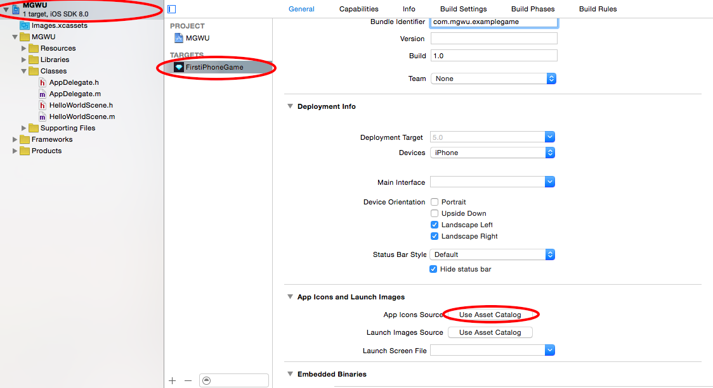
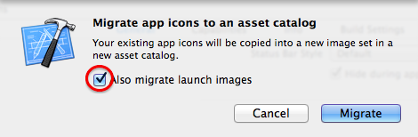
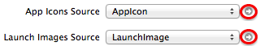
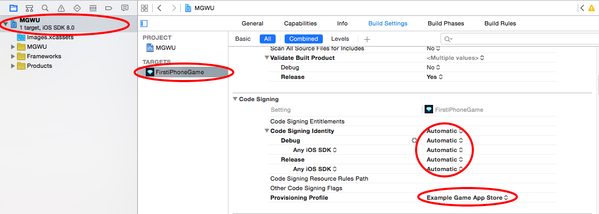
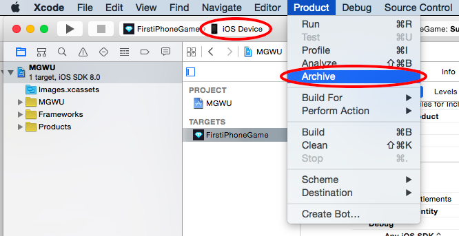
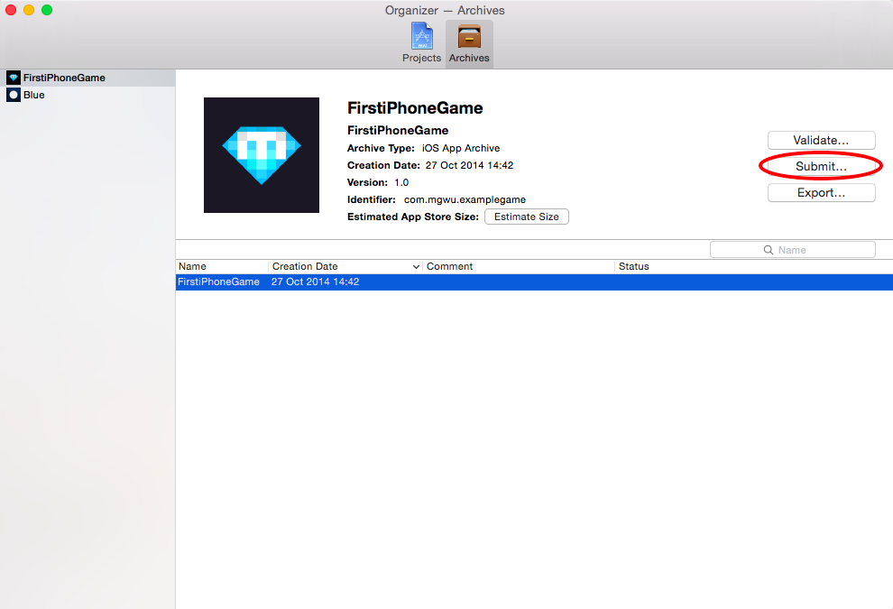
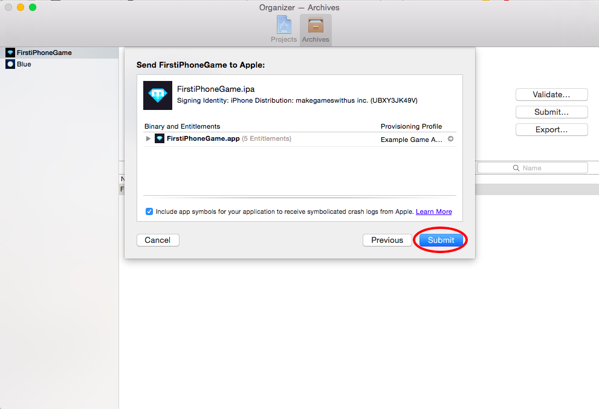

###Useful links and resources for icons and app store screenshots
- _Online editors_:
  - [Makeappicon](https://makeappicon.com)
- _Software/Applications_:
  - __Sketch__
      - [designmodo](http://designmodo.com/icon-design-sketch/)
      - [sketchappsources](http://www.sketchappsources.com/tutorials-tips.html)
      - [MengTo/AppStoreSketch](https://github.com/MengTo/AppStoreSketch)
  - __Photoshop__
      - [raywenderlich](https://www.raywenderlich.com/71175/make-great-app-store-screenshots)

Every App for iOS needs Launch Images and App Icons in a variety of sizes - to support the different iOS devices available.

App Icons and Launch Images for your App need to be set up in Xcode. This can be done easiest by using an *Asset Catalog*. Select the *Use Asset Catalog*. When Xcode asks if

In the Popup make sure to hit the checkbox and migrate Launch Images as well:

Now you will see two arrows appear that allow you to open the Asset Catalog by clicking on them:

Click the arrow next to the App Icon entry and it will open your current App Icon Set inside of the Asset Catalog:

Apple provides a [nice guide](https://developer.apple.com/library/IOs/documentation/UserExperience/Conceptual/MobileHIG/IconMatrix.html#//apple_ref/doc/uid/TP40006556-CH27-SW1) that lists App Icon and Launch Image sizes and requirements. You should fill all the empty slots in your asset catalog before submitting your app. You can add images by dragging them to the appropriate slot.

#Code Signing
Every iOS app gets signed digitally so that the App Store and the User can ensure that the apps being installed are actually provided by the claimed developer.

Earlier we have created a provisioning profile and a certificate for the purpose of signing our app for the App Store. Now you need to select the Provisioning Profile you created for the App Store within Xcode.

You do that by selecting your App target and opening the build setting. Here you choose the provisioning profile that you have created earlier:

#Archive and Upload

Now it's time to build your App and upload it to the App Store. In Xcode (Note that *iOS Device* needs to be selected instead of the Simulator for the *Archive* option to be available):

After the App was archived sucessfully, *Organizer* should show up and show you the binary you just built (if the window does not open automatically you can open it from *Window -> Organizer*).

Hit the *Submit...* Button to upload your Binary:

Now you will have to log in with your Apple Developer account. After you logged in successfully you will see a second screen that summarizes your submission; select *Submit* again:

After validating your App, which could take a few moments, Xcode will upload it to iTunes Connect. Once the upload is complete you will get a confirmation message.
